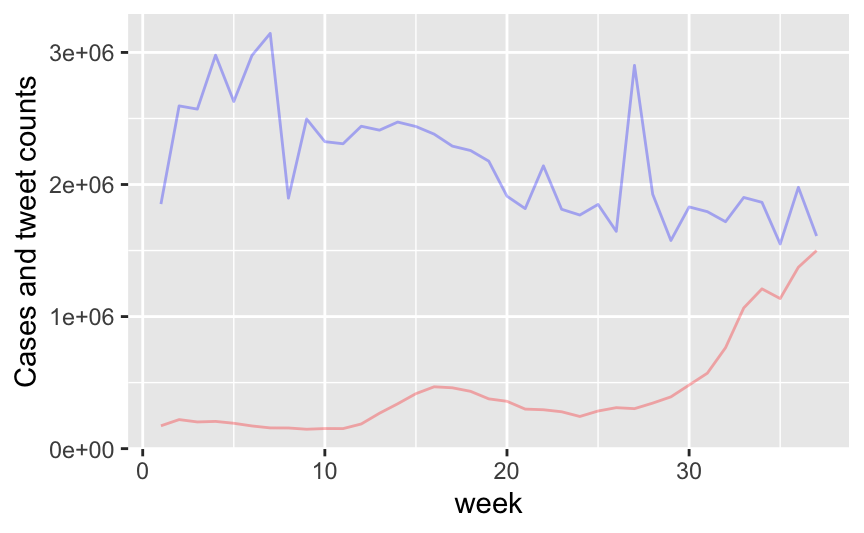
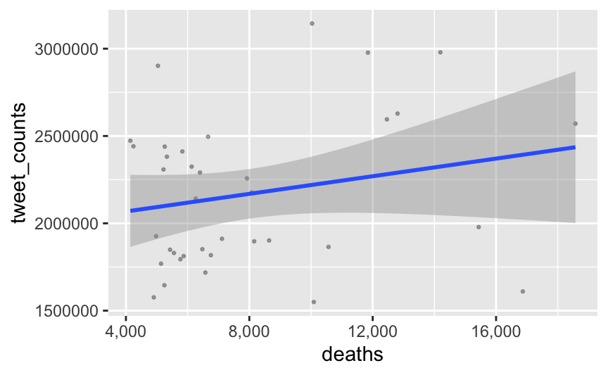
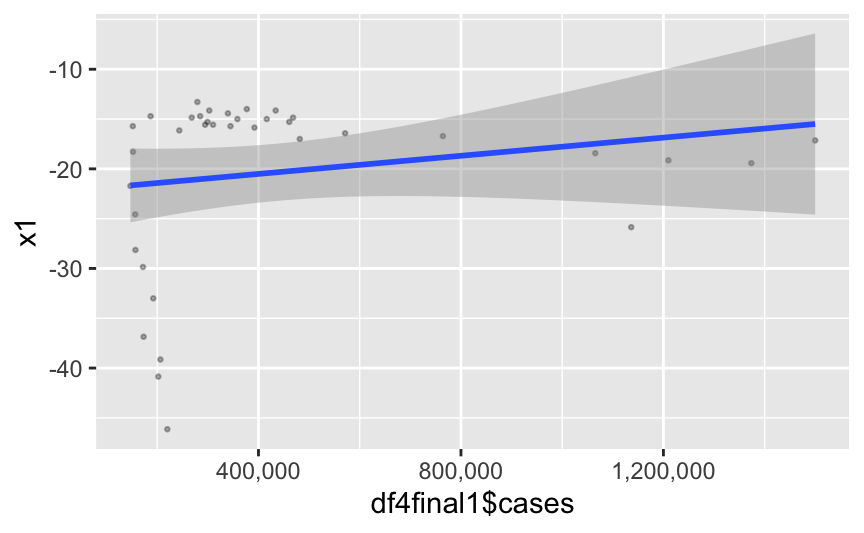
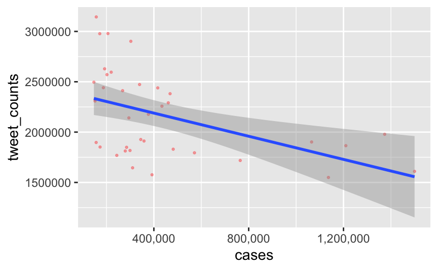
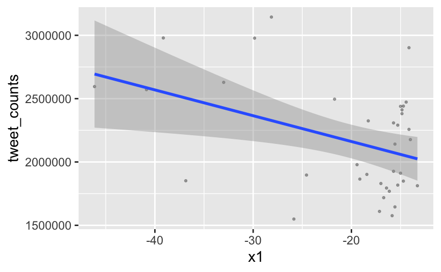

# Results
```{r loading, echo=FALSE, warning=FALSE, results='hide', fig.keep='all', message=FALSE}
# knitr::opts_chunk$set(echo = TRUE)
# 
# pkg_check <- function(pkg) {
#   if (!require(pkg, character.only = TRUE)) {
#     install.packages(pkg, dependencies = TRUE)
#   }
# }
# 
# pkg_check("tidyverse")
# pkg_check("ggplot2")
# pkg_check("tidyr")
# pkg_check("dplyr")
# pkg_check("knitr")
# pkg_check("gridExtra")
# pkg_check("tibble")
# pkg_check("GGally")
# pkg_check("parcoords")
# pkg_check("vcd")
# pkg_check("ggmosaic")
# pkg_check("tidyverse")
# pkg_check("ggridges")
# 
# # Original file (101 mb)
# tweets_with_mobility <- "https://us-congress-twitter-covid.s3.amazonaws.com/tweets_yearly_mobility_data.csv"
# tweets <- read_csv(tweets_with_mobility)
# ```
# 
# <!-- Nicolo's Code START -->
# ```{r}
# # we filter the dataset to include only USA, this is because we are assuming that the majority of the english language tweets we are dealing are coming from USA.
# # In data we are storing the data coming from https://www.ecdc.europa.eu/en/publications-data/download-todays-data-geographic-distribution-covid-19-cases-worldwide
# #which is recording the number of cases and deaths ion every day of 2020 by country.
# 
# # Ignoring
# # testdata<-data[data$countryterritoryCode=='USA',]
# 
# #We are going to aggregate our values, in ciao1 we have the top 50 bigrams in tweets for each day. So in this case we are grouping the tweets by each day, so that we have a table showing year,month, day and the total number of Covid-related bigrams. We focused on bigrams so we can catch the combination COVID 19 among others
# 
# ciao1_mod<-aggregate(ciao1$counts,by=list(ciao1$year,ciao1$month,ciao1$day),FUN=sum)
# #we are going to change the column's name (apparently when aggregating we are losing the columns names)
# colnames(ciao1_mod)[1]<-'year'
# colnames(ciao1_mod)[2]<-'month'
# colnames(ciao1_mod)[3]<-'day'
# colnames(ciao1_mod)[4]<-'tweet_counts'
# 
# #We are going to order our data by date, so we will be able to use a function to get rid of the dates and just use a common column called interval, so that we will be able to test our correlation between different spans of time
# #We are going to order both cases and deaths, and tweets by their date
# df3<-testdata[order(testdata$year,testdata$month,testdata$day), ]
# df3 %>% map_df(rev)
# ciao1_mod3<-ciao1_mod[order(ciao1_mod$year,ciao1_mod$month,ciao1_mod$day),]
# ciao1_mod3 %>% map_df(rev)
# #We are going to create a column interval, so that we can geet rid of the dates and ease up the merging of different tables and for now we set it to 0
# ciao1_mod3$interval=0
# df3$interval=0
# #Now we are going to align the two tables so to have similar periods of time for our analysis. For this purpose we are going to consider the period from 04/1/2021 to the day 12/14/2021 which is the last one in one of the two tables
# #To do that we filter our rows in that specific period
# df3<-df3[df3$month>=4 & df3$year==2020,]
# ciao1_mod3<-ciao1_mod3[ciao1_mod3$month>=4 & ciao1_mod3$year==2020,]
# #We find out that the cases and deaths df is only till 12/14/2020 but the tweets is to 12/30 so we are going to eliminate the last 16 rows in our tweets df
# n<-dim(ciao1_mod3)[1]
# ciao1_mod3<-ciao1_mod3[1:(n-16),]
# #We obtained the two datasets cleaned and parsed, the next styep would be to implement a function to create intervals
# # Instead of having dates, we are going to pass a parameter k and divide the days we had into intervals
# 
# ```
# ```{r}
# #We decided that 7 days would be a nice interval to keep, it means we are going to conduct our correlation weekly. Of course we could change k to 14
# k<-7
# do_interval<-function(df,interval){
#   # we are going to start numerating it from 1 cause we need to create a new column
#   c=1
# for (row in 1:nrow(df)){
#     df[row,'interval']<- floor(c/interval)+1
#   
# #We increase our counter and divide by the interval parameter so that for each day we have the correspondant interval in a separeted column
# c=c+1
# }
#  #here we are going to aggregate the cases, deaths or other metrics based on the intervals
#   #The conditions that we put on the number of columns is used to differentiate the different data sets that we are going to pass. 
#   if (ncol(df)>6){
#     
#     if(ncol(df)<14 & ncol(df)!=10){
#     # We are in the cases and deaths table here
#     #summing the variables on grouping by the interval
# df<-aggregate(cbind(df$cases,df$deaths),by=list(df$interval),FUN=sum)
# colnames(df)[1]<-'interval'
# colnames(df)[2]<-'cases'
# colnames(df)[3]<-'deaths'
#     }else{
#   #we are in the travel table here
#   df<-aggregate(cbind(df[c(1:6)]),by=list(df$interval),FUN=sum)
#   colnames(df)[1]<-'interval'
# }
# }else{
#   #we are in the tweet counts table here
#   df<-aggregate(df$tweet_counts,by=list(df$interval),FUN=sum)
#   colnames(df)[1]<-'interval'
#   colnames(df)[2]<-'tweet_counts'
#   }
#   return(df)
# }
# df31<-do_interval(df3,k)
# df32<-do_interval(ciao1_mod3,k)
# # we are going to merge by our interval, so then we can calculate correlation and plot the scatterplot and the best fitting line.
# df3_final<-merge(df31,df32,by=c('interval'))
# corr1<-cor(df3_final$cases, df3_final$tweet_counts)
# cortest1<-cor.test(df3_final$cases, df3_final$tweet_counts)
# corr2<-cor(df3_final$deaths, df3_final$tweet_counts)
# cortest2<-cor.test(df3_final$deaths, df3_final$tweet_counts)
# ggplot(df3_final, aes(x = deaths, y = tweet_counts)) + geom_point(size = 0.5, alpha = 0.3, col='black') + scale_x_continuous(labels = scales::comma)+geom_smooth(method=lm)
# ggplot(df3_final, aes(x = cases, y = tweet_counts)) + geom_point(size = 0.5, alpha = 0.3, col='red') + scale_x_continuous(labels = scales::comma)+geom_smooth(method=lm)
# #visualizing the time series of the cases 
# ggplot(df3_final,aes(x=interval))+ geom_line(aes(y=cases),size = 0.5, alpha = 0.3, col='red') + geom_line(aes(y=tweet_counts),size = 0.5, alpha = 0.3, col='blue')+scale_x_continuous(labels = scales::comma)+xlab('week')+ylab('Cases and tweet counts')
# # we decided to divide by the average so to normalize our results and have a sense of what the correlation is
# # in this case, the y axis is not useful, but we just observe the patterns
# ggplot(df3_final,aes(x=interval))+ geom_line(aes(y=deaths/mean(deaths)),size = 0.5, alpha = 0.3, col='red') + geom_line(aes(y=tweet_counts/mean(tweet_counts)),size = 0.5, alpha = 0.3, col='blue')+scale_x_continuous(labels = scales::comma)+xlab('week')+ylab('Proportions of deaths and tweet counts')
# ```
# Observations. If we take a look at our correlations coefficient we can see two different stories. When it comes to number of covid-related tweets in relation to the number of deaths we have low correlation . The correlation coefficient is this case is 0.21(corr2), which means there is a positive correlation. However if we take a look at the correlation test cortest2 we can see that the pvalue is 0.1951, hence even with a confidence level of 10% we cannot reject the null hypothesis that the correlation happened by chance.
# On the other hand, we can analyse our correlation of cases and number of tweets.In corr1 we have stored a correlation value of -0.48 and the associated pvalue is 0.0025, which means we can reject our null hypothesis and state that there is a correlation between the number of cases and number of tweets. 
# The surprising feature, is that the correlation is negative, where common sense may suggest there would be a positive correlation.In other words, we may expect, higher number of cases could trigger a higher number of people talking about it.
# The truth may be another one. We suspect that the real correlation may be linked to the dates itself. As we can see in the interval chart, we have that in the first 5 weeks (start date 4/1/2020), people were more scared and more prone to talk about it, then as the virus became usual among our lives, the covid tweets chat started to slowly but steadily decline. Even in the last part of the graph, when cases started taking off exponentially, the number of covid related tweets continued to slow.  
# 
# ```{r}
# # In movements we have the changing for percentage of transit of people in comparison to same period of time in 2019in the whole USA
# dfmove<-Movements
# # We have to convert the dates that we have in a more suitable format so that we can use the comparison to other dfs
# for (row in 1:nrow(dfmove)){
#   
#     date<-dfmove[row,'date']
#     arr<-strsplit(date,split='-')
#     dfmove[row,'year']=(arr[[1]][1])
#     dfmove[row,'month']=(arr[[1]][2])
#     dfmove[row,'day']=(arr[[1]][3])
#    # dfmove[row,'day']=strtoi(arr[[1]][3])
# }
# 
# dfmove$year<-as.integer(dfmove$year)
# dfmove$month<-as.integer(dfmove$month)
# dfmove$day<-as.integer(dfmove$day)
# dfmove<-dfmove[dfmove$month>=4 & dfmove$year==2020,]
# n<-dim(dfmove)[1]
# dfmove<-dfmove[1:(n-18),]
# # we are going to get the columns that we need, cleaning the data from useless columns
# dfmove$interval<-0
# dfmove<-dfmove[c(10:19)]
# #We order them by the date so we can use the function do_interval and compare the results
# dfmove<-dfmove[order(dfmove$year,dfmove$month,dfmove$day),]
# dfmove %>% map_df(rev)
# dfmovem<-do_interval(dfmove,k)
# #To have the correct change over the period, we are going to divide the columns by the period
# 
# dfmovem[2:7]<-dfmovem[,2:7]/k
# 
# df4final<-merge(dfmovem,df32,by=c('interval'))
# df4final1<-merge(dfmovem,df31,by=c('interval'))
# #We set a parameter so that we can easily change for our visualization
# x1<-df4final$retail_and_recreation_percent_change_from_baseline
# corr41<-cor(x1, df4final$tweet_counts)
# cortest41<-cor.test(x1, df4final$tweet_counts)
# corr42<-cor(x1, df4final1$cases)
# cortest42<-cor.test(x1, df4final1$cases)
# ggplot(df4final, aes(x = x1, y = tweet_counts)) + geom_point(size = 0.5, alpha = 0.3, col='black') + scale_x_continuous(labels = scales::comma)+geom_smooth(method=lm)
# ggplot(df4final1, aes(x=df4final1$cases, y = x1)) + geom_point(size = 0.5, alpha = 0.3, col='black') + scale_x_continuous(labels = scales::comma)+geom_smooth(method=lm)
# #create a ridgepllot with the different 
# #pivoted<-pivot_longer(df4final,cols = #c(df4final$retail_and_recreation_percent_change_from_baseline,df4final$grocery_and_pharmacy_percent_change_from_basel#ine,df4final$parks_percent_change_from_baseline,df4final$transit_stations_percent_change_from_baseline,df4final$workp#laces_percent_change_from_baseline,df4final$residential_percent_change_from_baseline),names_to = 'type',values_to = #'vals')
```
<!-- Nicolo's Code END -->






If we take a look at our correlations coefficient we can see two different stories. When it comes to number of covid-related tweets in relation to the number of deaths we have low correlation . The correlation coefficient is this case is 0.21(corr2), which means there is a positive correlation. However if we take a look at the correlation test cortest2 we can see that the pvalue is 0.1951, hence even with a confidence level of 10% we cannot reject the null hypothesis that the correlation happened by chance.
On the other hand, we can analyse our correlation of cases and number of tweets.In corr1 we have stored a correlation value of -0.48 and the associated pvalue is 0.0025, which means we can reject our null hypothesis and state that there is a correlation between the number of cases and number of tweets. 
The surprising feature, is that the correlation is negative, where common sense may suggest there would be a positive correlation.In other words, we may expect, higher number of cases could trigger a higher number of people talking about it.
The truth may be another one. We suspect that the real correlation may be linked to the dates itself. As we can see in the interval chart, we have that in the first 5 weeks (start date 4/1/2020), people were more scared and more prone to talk about it, then as the virus became usual among our lives, the covid tweets chat started to slowly but steadily decline. Even in the last part of the graph, when cases started taking off exponentially, the number of covid related tweets continued to slow.





We can observe that we have a negative correlation between the retail and recreation activity movement and the number of tweets. Which means that in general, the more tweet are written, the less mobility was experienced for the purposes aforementioned. The cause of this may rely in again more in the timeline of events. The biggest mobility changes may have occurred at the start of the pandemics in USA. Therefore,we know the highest number of tweets were at the start of (first 10 weeks). This fact coupled with the fact that either because people were more scared to go out, or either because some restricting policies were promoted; could be the reason of this negative correlation. This correlation has a very low p-value of 0.0118, hence we can again refuse the null hypothesis at a 2% confidence level. On the other hand, we cant make any assumption on the retail movement,because of the p-value.

## COVID vs. Mobility

```{r correlation, echo=FALSE, warning=FALSE, results='hide', fig.keep='all', message=FALSE, fig.align='center'}
covid_correlation <- tweets
names(covid_correlation)
covid_correlation_vars <- c("full_name_of_member", "covid_label", "retail_and_recreation_percent_change_from_baseline", "grocery_and_pharmacy_yearly_percent_change","parks_percent_yearly_change", "transit_stations_yearly_percent_change" , "workplaces_yearly_percent_change","residential_yearly_percent_change" )

covid_correlation <- covid_correlation[covid_correlation_vars]
colnames(covid_correlation) <- c("name", "covid", "Retail & Recreation", "Grocery & Pharmacy", "Parks & Recreation", "Transit Station", "Workplaces", "Residential")

covid_correlation <- pivot_longer(
  data = covid_correlation,
  cols = -c(name, covid),
  names_to = "location_type",
  values_to = "change_in_mobility"
  )


covid_correlation
covid_correlation_to_plot <- covid_correlation %>% 
  group_by(name, location_type, change_in_mobility) %>% 
  summarise(
    n = n()    
  )

covid_correlation_to_plot
ggplot(covid_correlation_to_plot, aes(x=n, y=change_in_mobility)) + 
  geom_point() + 
  facet_wrap(~location_type) +
  ylab("Yearly Change in Mobility") +
  xlab("Number of COVID Related Tweets")
```
Rather unsurprisingly, there seems to be little correlation between the number of tweets by members of the US Congress and changes in mobility in their respective areas. However, something that is different across categories is the variance in the data. For example, the Parks & Recreation category has the highest variation followed by the Transit Station. It makes sense for the Residential and Workplaces categories to have low variance. One possible explanation is that Parks & Recreation encompasses a large variety of activities and settings. The outliers and difference in variance is a rather interesting phenomenon in this visualization. An interesting follow-up to this plot is the question: are the outliers across location categories the same congress members? It is possible that these are different outliers across each category. But there are 3 consistent outliers across the following categories: Grocery & Pharmacy, Parks & Recreation, Retail, and Transit Station.

```{r common_outliers, echo=FALSE, warning=FALSE, results='hide', fig.keep='all', message=FALSE, fig.align='center'}
# Loading initial CSV
outliers <- tweets

# Filtering out based on where outliers appear visually in first correlation plot
outliers <- filter(outliers, (parks_percent_yearly_change > 75) | (parks_percent_yearly_change < -40))
outliers <- filter(outliers, (transit_stations_yearly_percent_change < -50))
outliers <- filter(outliers, (retail_and_recreation_percent_change_from_baseline < -30))
outliers <- filter(outliers, (grocery_and_pharmacy_yearly_percent_change < -20))

# Counting tweets by congress member and whether or not tweet was labeled as "covid-19" related
outliers <- outliers %>%
  group_by(full_name_of_member, covid_label) %>%
  summarise(count = n())

# Bar chart of tweets for outlier members
ggplot(outliers, 
  aes(x = reorder(full_name_of_member, -count), y = count, fill = covid_label)) + 
  geom_bar(stat="identity") + 
  xlab("Name of Congress Member") + 
  ylab("Number of Tweets")
```
The outliers in the aforementioned categories are in fact the same 3 outliers! Most of them have non-covid related tweets which could be why they are so influential. Mazie K. Hirono is senator from Hawaii, Brian Schatz is a senator from Ohio, and Ed Case is a representative from Hawaii. Since two senators are from Hawaii, this suggests a geographic element to the extreme changes in mobility relative to other representatives. That being said, having a member from Ohio casts doubt on a solely geographic explanation. We can look at the content of their tweets a bit more closely to uncover any potential patterns. Specifically, let us look at the content of their tweets for COVID adjacent terms (masks, vaccines, etc).

```{r congress_sentiment, echo=FALSE, warning=FALSE, results='hide', fig.keep='all', message=FALSE, fig.align='center'}
# Selecting relevant columns of tweet data
df <- tweets[c("full_name_of_member", "tweet_content")]

# Filtering down to our outliers
df <- filter(df, full_name_of_member == "Mazie K. Hirono" | full_name_of_member == "Ed Case" |full_name_of_member == "Brian Schatz")

# Function to label sentiment of text
add_keyword_column <- function(df, name, keywords) {
    df[name] <- df %>% apply(1, function(row) {
    for (kw in keywords) {
      if (grepl(kw, tolower(row['tweet_content']), fixed = TRUE)) {
        return(TRUE);
      }
    }
    return(FALSE);
  });
  return(df);
}

# Keywords
VACCINE_KEYWORDS <- c("vaccination", "vaccinated", "vaccine")
TESTING_KEYWORDS <- c("testing", "gettested", "tested", "PCR")
LOCKDOWN_KEYWORDS <- c("lockdown", "quarantine", "quarantining")
MASK_KEYWORDS <- c("mask", "face covering", "face cover", "masking", "facemask")
SOCIAL_DISTANCING_KEYWORDS <- c("social distancing", "socialdistancing", "safe distance", "physical distancing", "6 feet apart", "6feetapart")
HERD_IMMUNITY_KEYWORDS <- c("herd immunity")

# Sentiment labeling
df <- add_keyword_column(df, 'vaccine', VACCINE_KEYWORDS)
df <- add_keyword_column(df, 'testing', TESTING_KEYWORDS)
df <- add_keyword_column(df, 'lockdown', LOCKDOWN_KEYWORDS)
df <- add_keyword_column(df, 'mask', MASK_KEYWORDS)
df <- add_keyword_column(df, 'social_distancing', SOCIAL_DISTANCING_KEYWORDS)
df <- add_keyword_column(df, 'herd_immunity', HERD_IMMUNITY_KEYWORDS)

# Combining sentiment booleans into single column
df <- pivot_longer(df, 
                   cols = -c("full_name_of_member", "tweet_content"), 
                   names_to = "Sentiment_Category", 
                   values_to = "Present")

# Removing tweet itself and casting booleans to integers
df <- df[, !names(df) %in% c("tweet_content")]
df$Present <- as.numeric(df$Present) 

# Getting 
df <- df %>% 
  group_by(full_name_of_member, Sentiment_Category) %>% 
  summarise_at(vars(Present), list(name = sum))

ggplot(df, aes(x = name, y = reorder(Sentiment_Category, +name))) + 
  geom_bar(stat="identity", orientation='y') + 
  facet_wrap(~full_name_of_member) +
  xlab("Number of Tweets in 2020") +
  ylab("Sentiment Category")
```
While it is no surprise that vaccines, testing, and masks were included among these outliers, it is interesting to note that social distancing is not as frequently mentioned. Perhaps this is a clue to the types of outreach and education that sticks with constituents. Masks and testing appear to be the most consistently frequent sentiments across the congress members' tweets. Herd immunity is also absent from these outliers' tweets.

## Analyzing the policy of representatives of Congress through their tweets

### Extracting the data

We now have a look at what COVID-related policies the representatives of US Congress tweet about, and how they feel about those. To this end, we collected a dataset of all tweets from the representatives in the year 2020 as described in section 2. We captured the sentiment of these tweets through a Natural Language Processing model that gave each tweet a 'positive' and a 'negative' score. We elaborated on this in section 3.

Over the course of the pandemic, numerous ways have been suggested to *flatten the curve*. We summarize them into 5 categories: vaccination, testing, lockdown, face masks, and social distancing. For each category a number of keywords is specified:

| Policy            | Keywords                                                                                          |
|-------------------|---------------------------------------------------------------------------------------------------|
| Vaccination       | vaccination, vaccinated, vaccine                                                                  |
| Testing           | testing, gettested, tested, PCR                                                                   |
| Lockdown          | lockdown, quarantine, quarantining                                                                |
| Face masks        | mask, face covering, face cover, masking, facemask                                                |
| Social distancing | social distancing, socialdistancing, safe distance, physical distancing, 6 feet apart, 6feetapart |

As such, each tweet can be classified as 'related' to a certain policy by checking if it contains any of these keywords.

```{r, include=FALSE}
df <- read.csv("https://us-congress-twitter-covid.s3.amazonaws.com/congress_twitter_sentiment.csv")
df <- subset (df, select = -X)
df <- drop_na(df)
```

```{r, include=FALSE}
add_keyword_column <- function(df, name, keywords) {
    df[name] <- df %>% apply(1, function(row) {
    for (kw in keywords) {
      if (grepl(kw, tolower(row['tweet_content']), fixed = TRUE)) {
        return(TRUE);
      }
    }
    return(FALSE);
  });
  return(df);
}

VACCINE_KEYWORDS <- c("vaccination", "vaccinated", "vaccine")
TESTING_KEYWORDS <- c("testing", "gettested", "tested", "PCR")
LOCKDOWN_KEYWORDS <- c("lockdown", "quarantine", "quarantining")
MASK_KEYWORDS <- c("mask", "face covering", "face cover", "masking", "facemask")
SOCIAL_DISTANCING_KEYWORDS <- c("social distancing", "socialdistancing", "safe distance", "physical distancing", "6 feet apart", "6feetapart")
HERD_IMMUNITY_KEYWORDS <- c("herd immunity")

df <- add_keyword_column(df, 'vaccine', VACCINE_KEYWORDS)
df <- add_keyword_column(df, 'testing', TESTING_KEYWORDS)
df <- add_keyword_column(df, 'lockdown', LOCKDOWN_KEYWORDS)
df <- add_keyword_column(df, 'mask', MASK_KEYWORDS)
df <- add_keyword_column(df, 'social_distancing', SOCIAL_DISTANCING_KEYWORDS)
df <- add_keyword_column(df, 'herd_immunity', HERD_IMMUNITY_KEYWORDS)
```


### Patterns in policy

In the media, it is clear that politicians' preferences for these policies largely differ. We try to find patterns in these preferences by firstly looking at the frequency in tweets related to these policies. In the parallel coordinate plot below, every line represents a member of Congress, the values correspond to the frequency of their tweets related to a certain policy.

```{r, echo=FALSE, warning=FALSE, results='hide', fig.keep='all', message=FALSE}
df %>%
  filter(party == "Democrat" | party == "Republican") %>%
  group_by(twitter_handle, party) %>%
  summarise(
    vaccine = mean(vaccine),
    testing = mean(testing),
    lockdown = mean(lockdown),
    mask = mean(mask),
    social_distancing = mean(social_distancing)
  ) %>%
  ungroup() %>%
  select(c(party, testing, mask, social_distancing, lockdown, vaccine)) %>%
  GGally::ggparcoord(columns = 2:6, groupColumn = "party", scale = "uniminmax", alphaLines = .35, splineFactor = 5) +
    scale_color_manual(values = c("#48A0DF", "#FA6A4B")) + 
    labs(title = "COVID related policies in tweets") + 
    xlab("Policy") +
    ylab("Tweet frequency")
```

```{r, include=FALSE}
df %>%
  group_by(state, party) %>%
  summarise(
    vaccine = mean(vaccine),
    testing = mean(testing),
    lockdown = mean(lockdown),
    mask = mean(mask),
    social_distancing = mean(social_distancing),
    herd_immunity = mean(herd_immunity)
  ) %>%
  ungroup() %>%
  select(c(party, vaccine, testing, lockdown, mask, social_distancing)) %>%
  parcoords::parcoords(
    withD3 = TRUE,
    color = c(colorScale = "scaleOrdinal", colorBy = 'party', rownames = FALSE),
    brushMode = "1d-axes",
    reorderable = TRUE
  ) 
```


We notice some interesting patterns here. Overall it is clear that democrats tweet more frequently about testing and masking up as preventive measures. Interestingly, there appears to be an inverse relationship between the tweet frequency on masks and social distancing. Some members of congress focus on masking up, whereas others shift their focus to social distancing as a way of slowing the spread of the virus. We can also see that few republicans tweet about masking up as a preventive measure, however, there is a significant fraction of republicans that do tweet about social distancing and testing in the battle against COVID. Though, the most frequent tweeters on social distancing are democrat.


Perhaps the most surprising insight in this graph is that a lockdown is more frequently discussed by republicans. We can see that not many democrats tweet about this, they resort to other policies. There are even some outliers among the republicans that tweet very frequently about a lockdown. Taking into account the media coverage over the past year this is rather surprising as the republican party generally advocated for opening up the country. The question remains whether these republicans are actually promoting or contesting a potential lockdown.


The sentiment analysis sheds some light on this. For every tweet we have a 'positive' and a 'negative' score provided by the NLP model. In the plot below we visualize the average 'positiveness' of tweets for every policy category, per party. This 'positiveness' is defined as the ratio of the average positive score for tweets related to a policy to the average score of tweets not related to this policy. A score > 1 indicates that tweets on a certain policy are generally more positive. A 'positiveness' < 1 indicates a rather negative sentiment towards this policy.


```{r, echo=FALSE, warning=FALSE, results='hide',fig.keep='all', message=FALSE}
policy_sent <- df %>%
  filter(party == "Democrat" | party == "Republican") %>%
  pivot_longer(c(vaccine, testing, lockdown, mask, social_distancing)) %>%
  group_by(name, party, value) %>%
  summarise(sent = mean(positive))

divide_by_fn <- function(sent, value) {
  if (value[1]) {
    return (sent[1]/ sent[2]);
  } else {
    return (sent[2] / sent[1]);
  }
}

policy_sent %>%
  group_by(name, party) %>%
  summarise(sent_diff = divide_by_fn(sent, value)) %>%
  ggplot(aes(x=name, y=sent_diff, fill=party)) +
  geom_bar(stat="identity", position=position_dodge()) +
  scale_fill_manual("legend", values = c("Democrat" = "#48A0DF", "Republican" = "#FA6A4B")) +
  xlab("Policy") + 
  ylab("Positiveness score") + 
  labs(title = "Sentiment profile")
```
```{r, include=FALSE}
lockdown_freqs <- df %>% 
  group_by(twitter_handle) %>%
  summarise(lockdown_freq = mean(lockdown))

lockdown_freqs[lockdown_freqs$lockdown_freq == max(lockdown_freqs$lockdown_freq),]
```

For all policy categories except 'lockdown', the sentiment is about the same for both parties. However, a lockdown is contentious. There is a clear negative sentiment of republicans towards a lockdown, whereas for democrats a lockdown is percepted more positive than other measures. Republican representative @RepDanCrenshaw is the furthest outlier on the lockdown scale. His tweets indeed show a very negative sentiment towards a lockdown:

```{r, echo=FALSE, warning=FALSE}
tweets <- df %>%
  filter((twitter_handle == "RepDanCrenshaw") & lockdown) %>%
  top_n(5, -positive) %>%
  select(tweet_content)

for (tweet in tweets) {
  print(tweet);
}
```

```{r, include=FALSE}
freqs <- df %>% 
  group_by(twitter_handle) %>%
  summarise(freq = mean(social_distancing))

freqs[freqs$freq == max(freqs$freq),]
```

We compare his sentiment profile to that to one of the democrats from the cluster that promotes social distancing the most: @RepKathleenRice.


```{r, echo=FALSE, warning=FALSE, results='hide', fig.keep='all', message=FALSE}
policy_sent <- df %>%
  filter(party == "Democrat" | party == "Republican") %>%
  pivot_longer(c(vaccine, testing, lockdown, mask, social_distancing)) %>%
  group_by(twitter_handle, name, party, value) %>%
  summarise(sent = mean(positive))

divide_by_fn <- function(sent, value) {
  if (value[1]) {
    return (sent[1]/ sent[2]);
  } else {
    return (sent[2] / sent[1]);
  }
}

policy_sent %>%
  group_by(twitter_handle, name, party) %>%
  summarise(sent_diff = divide_by_fn(sent, value)) %>%
  filter(twitter_handle == "RepDanCrenshaw" | twitter_handle == "RepKathleenRice") %>%
  ggplot(aes(x=name, y=sent_diff, fill=twitter_handle)) +
  geom_bar(stat="identity", position=position_dodge()) +
    scale_fill_manual("legend", values = c("RepDanCrenshaw" = "#FA6A4B", "RepKathleenRice" = "#48A0DF")) +
  xlab("Policy") + 
  ylab("Positiveness score") + 
  labs(title = "Sentiment profile")
```

Although the democrat representative @RepKathleenRice is significantly less vocal about a lockdown, her tweets on the matter are convincingly positive. @RepDanCrenshaw's is relatively pessimistic. He clearly prefers social distancing and vaccination as opposed to masking up and a lockdown.